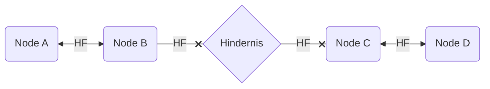
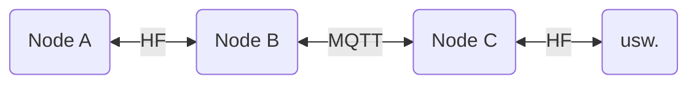

# Bridging in meshtastic

### Wie uns der Netzwerkstack hilft, Lücken zu schließen

## Problem

Nutzende betreiben meshtastic-Nodes, die sich nicht via Hochfrequenz (HF) erreichen können. In der Grafik nennen wir es mal "Hindernis".

Hier würden Netzwerkfragmente entstehen, die zwar semantisch vielleicht irgendwie zueinander gehören, bei denen einen HF-Übertragung aber eben nicht möglich ist.

Die `Nodes C+D` wird von der Kommunikation auf der "Seite" von `A` und `B` nichts sehen.

### Szenarien

* Wir organisieren ein Mesh im Raum XY. Ein befreundeter Mensch in der Nachbarstadt Z möchte teilnehmen, nur leider wohnen wir alle in einer hügeligen Gegend, auf der wir nicht auf jeden Hügel einen Repeater stellen können. Unsere Nodes sehen sich nicht. **Hindernis: Topographie**.
* Wir haben Funkamateure, die Hardware für das Amateurfunkband bei 433 MHz herumliegen haben und das deshalb nutzen. Da wir Normalos die Amateurfunkvorzüge dort eh nicht nutzen dürfen, sind wir aber auf 868 MHz unterwegs, weil uns das SRD-Band mehr bietet. **Hindernis: Technologieentscheidung**.
* Einer unserer teilnehmenden Menschen zieht um nach 300 Kilometer weiter. Lebte er in einem Wetterballon hätten wir ja noch Chancen ;-) aber auch hier wäre er raus aus "dem Netz". **Hindernis: Entfernung**.

## Lösung

Meshtastic unterstützt TCP/IP-Netzwerke via _WLAN_, ebenso _MQTT_. MQTT wird dabei z.B. zur Übertragung der Position (wie bei [meshmap](https://meshmap.net)) genutzt, kann aber auch zur Übermittlung der Nachrichten-Payloads dienen. Dies funktioniert im Up- und Downstream, d.h. per HF empfangene Nachrichten werden auf die Queue umgesetzt, gleichzeitig über die Queue empfangene Nachrichten auf HF umgesetzt.

Das "abgehängte" Fragment und alle seine nachgelagerten Nodes sind nun wieder im erreichbaren Mesh. Über diese Mechanik können wir jedes der beschriebenen Szenarien lösen.

(Gleichzeitig haben wir die Freiheit, nur den einen oder anderen Weg zu nutzen: Downstream unseres Traffics geht auch ohne den Upstream senden zu müssen. Vielleicht ist das zu was gut.)

## Nachteile

* Gesteigerter Hardwareeinsatz
    * Irgendwo muss diese MQTT ja laufen
        * Entweder im Netz, da bräuchten wir Server,
        * oder lokal, da bräuchten wir auch Server.
    * Die Nutzung der Projekt-MQTT würde ich vermeiden wollen
        * Auch mit guter Einschränkung des Topics kann da mehr Traffic kommen, als wir on-air-time haben
        * Die Möglichkeit für Floods/DoS ist zu einfach. Wir müssen mit Missbrauch rechnen.
* Höherer Stromverbrauch
    * Wir brauchen einen Server, auch als lokaler Microcontroller braucht der eben Strom
    * Neben LoRa fahren die Nodes jetzt auch noch durchgehend Wifi. Das ist energetisch teuer. Deshalb haben wir ja LoRa ... oh wait. Na jedenfalls müssen wir bei solargepufferten Nodes auf den Akku schauen, ein mit WIFI laufendes ESP32-Board gönnt sich schonmal dreistellig Milliampere.
* Interessantere Wartung
    * Welchen Weg wir auch wählen, wir entscheiden uns für mehr Aufwand im Betrieb
    * Eine Urlaubsvertretung/ein mitmachender Mensch muss das System kennen und warten können
    * Die Komplexität steigt. Das muss eine lokale Gruppe handhaben können.

### Hindernisse Entfernung und Topographie

Zuerst einmal, wir können **weiter off-grid arbeiten, aber off-network sind wir nicht mehr**. Nodes können zwar miteinander reden, aber hier sind wir auf funktionierendes Interwebs angewiesen. Als _Notfallradio_ taugt unser Konstrukt jetzt wahrscheinlich nicht mehr so gut, die Chancen sind im [HAMnet](https://ampr.org) allenfalls besser, aber nicht verlässlich gut.

### Hindernis Technologieentscheidung

Hier können wir **sowohl off-grid als auch off-network** arbeiten. Wir bauen uns einen _Umsetzer_, der ohne Interwebsressourcen auskommt. Gehen wir mal davon aus, dass wir ein Fragment im Bereich 433 MHz haben, dazu noch eines auf 868 MHz, dann können wir einen weiteren Microcontroller nutzen um uns sowohl das Netzwerk (als WIFI-Accesspoint) als auch die Anwendung MQTT bereitstellt. Alle 3 Boards hängen wir an den Solarstrom und haben unsere Brücke. Ein Beispiel-Sketch dazu liegt [hier](https://github.com/pkornherr/LoRa/blob/main/WiFi-MQTT-Sketch/WiFi-MQTT-Sketch.ino).

## Einstellungen in Meshtastic

1. **MQTT anschalten**
   `Moduleinstellungen->MQTT` enthält alle Parameter zum MQTT-Server. Host-/Usernamen, ob die Verbindung transportverschlüsselt wird etc pp. Die Angaben übernehmt ihr für den Projektserver oder ändert sie auf die für euch passende Verbindung.
   Interessant sind hier die Einstellungen
      * `Encryption enabled` (damit werden die Nachricht auf der Queue mit dem on-air-Channelkey verschlüsselt)
      * `JSON enabled` (schickt die Nachrichten auch als JSON, zum Mitlesen sehr hilfreich) und das
      * `root topic`. Hier stellen wir den Pfad ein, unter dem usere Nodes sich in ihrer eigenen Struktur letztlich unterhalten sollen. Die defaults "msh/EU_433" auf dem Projektserver solltet ihr **vermeiden bzw nur für Tests nutzen**, da dort eher viele Nodes sind, die ihr dann mitbridgen würdet - was ihr vermutlich nicht wollt. Wählt einen möglichst spezifischen Pfad, z. B. "msh/DE/BY/Coburg" wenn ihr in Coburg, Bayern, Deutschland seid.
Falls ihr eh einen eigenen, privaten Server für die MQTT nutzt ist das natürlich irrelevant.
3. **MQTT entignorieren**
    Per default ist der Punkt `Geräteeinstellungen->LoRa->Ignore MQTT` auf **an**. Das sorgt dafür, dass der Node Nachrichten, die über einen MQTT-Pfad gekommen sind, ignoriert und damit auch nicht weiterleitet. Das sollte also auf allen Knoten, die über die Bridge kommunizieren wollen, ausgeschaltet sein.
4. **MQTT erlauben**
    In einer späten 2.5-Release kam ein neuer Schalter dazu, den wir anschalten müssen, wenn unsere Nachrichten gebridged werden dürfen: `Geräteeinstellungen->LoRa->OK to MQTT`. Vorsicht: Wird beim Flashen der neueren Firmware die Konfiguration nicht geändert, funktioniert das _per default_ nicht mehr!
5. **Channels konfigurieren**
    Jeder Kanal, der über die Bridge laufen soll, muss das explizit eingestellt haben, der default ist keine Weiterleitung! `Radio Config->Channels` bringt euch zu den Kanälen. Wählt den zu bridgenden Kanal aus und schaltet `Downlink enabled` (überträgt von der MQTT per HF) und `Uplink enabled` (überträgt eure HF-Nachrichten an die MQTT) **an**

Das wars schon! Viel Spaß beim Bridges bauen! Nachher kanns so aussehen:

### Zum Schluss
Ergänzungen, Erweiterungen etc pp nehme ich gerne als Pull Request an. Stand der ganzen Sache ist der 31.10.2024. Etwaige andere Hinweise gerne auch per Mail!

[peterisok](mailto:peterisok@hackzogtum-coburg.de), [DK4KP](https://bravo19.de), [Hackzogtum Coburg](https://hackzogtum-coburg.de)
