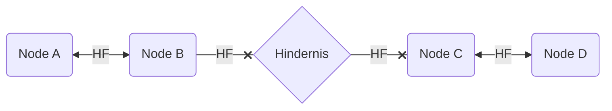
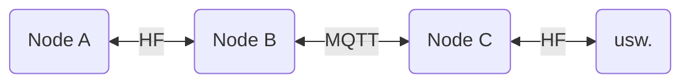

# Bridging in meshtastic

### Wie uns der Netzwerkstack hilft, Lücken zu schließen

### [peterisok](mailto:peterisok@hackzogtum-coburg.de), [Hackzogtum Coburg](https://hackzogtum-coburg.de)

## Problem

Nutzende betreiben meshtastic-Nodes, die sich nicht via Hochfrequenz (HF) erreichen können. In der Grafik nennen wir es "Hindernis".

Hier würden Netzwerkfragmente entstehen, die zwar semantisch vielleicht irgendwie zueinander gehören, bei denen einen HF-Übertragung eben nicht möglich ist.

`Node C` wird von der Kommunikation auf der "Seite" von `A` und `B` nichts sehen.

### Szenarien

* Wir organisieren ein Mesh im Raum XY. Ein befreundeter Mensch in der Nachbarstadt Z möchte teilnehmen, nur leider wohnen wir alle in einer hügeligen Gegend, auf der wir nicht auf jeden Hügel einen Repeater stellen können. Unsere Nodes sehen sich nicht. **Hindernis: Topographie**.
* Wir haben uns Funkamateure eingetreten, die Hardware für das Amateurfunkband bei 433 MHz herumliegen haben und das deshalb nutzen. Da wir Normalos die Funkervorzüge dort eh nicht nutzen dürfen, sind wir aber auf 868 MHz unterwegs, weil uns das SRD-Band mehr bietet. **Hindernis: Technologieentscheidung**.
* Einer unserer teilnehmenden Menschen zieht nach $Großstadt 300 Kilometer weiter. Wäre er in einem Wetterballon hätten wir ja noch Chancen ;-), aber auch hier wäre er raus aus "dem Netz". **Hindernis: Entfernung**.

## Lösung

Meshtastic unterstützt TCP/IP-Netzwerke via WLAN, ebenso MQTT. MQTT wird dabei z.B. zur Übertragung der Position (wie bei [meshmap](https://meshmap.net)) genutzt, kann aber auch zur Übermittlung der Nachrichten-Payloads dienen. Dies funktioniert im Up- und Downstream, d.h. per HF empfangene Nachrichten werden auf die Queue umgesetzt, gleichzeitig über die Queue empfangene Nachrichten auf HF umgesetzt. 

Das "abgehängte" Fragment und alle seine nachgelagerten Nodes sind nun wieder im erreichbaren Mesh. Über diese Mechanik können wir jedes der beschriebenen Szenarien lösen.

(Gleichzeitig haben wir die Freiheit, nur den einen oder anderen Weg zu nutzen: Downstream unseres Traffics geht auch ohne den Upstream senden zu müssen. Vielleicht ist das zu was gut.)

## Nachteile

* Gesteigerter Hardwareeinsatz
    * Irgendwo muss diese MQTT ja laufen
        * Entweder im Netz, da bräuchten wir Server,
        * oder lokal, da bräuchten wir auch Server.
    * Die Nutzung der Projekt-MQTT würde ich vermeiden wollen
        * Auch mit guter Einschränkung des Topics kann da mehr Traffic kommen, als wir on-air-time haben
        * Die Möglichkeit für Floods/DoS ist zu einfach. Wir müssen mit Missbrauch rechnen.
* Höherer Stromverbrauch
    * Wir brauchen einen Server, auch als lokaler Microcontroller braucht der eben Strom
    * Neben LoRa fahren die Nodes jetzt auch noch durchgehend Wifi. Das ist energetisch teuer. Deshalb haben wir ja LoRa ... oh wait.
* Interessantere Wartung
    * Welchen Weg wir auch wählen, wir entscheiden uns für mehr Aufwand im Betrieb
    * Eine Urlaubsvertretung/ein mitmachender Mensch muss ein System mehr kennen und warten können
    * Ganz einfach: Die Komplexität steigt. Das muss eine lokale Gruppe handhaben können.

### Hindernisse Entfernung und Topographie

Zuerst einmal, wir können weiter off-grid arbeiten, aber off-network sind wir nicht mehr. Nodes können zwar miteinander reden, aber hier sind wir auf funktionierendes Interwebs angewiesen. Als "Notfallradio" taugt unser Konstrukt also wahrscheinlich nicht mehr, die Chancen sind im [HAMnet](https://ampr.org) bestenfalls besser, aber nicht verlässlich gut.

### Hindernis Technologieentscheidung

Hier können wir sowohl off-grid als auch off-network arbeiten. Wir bauen uns einen Umsetzer, der ohne Interwebsressroucen auskommt.